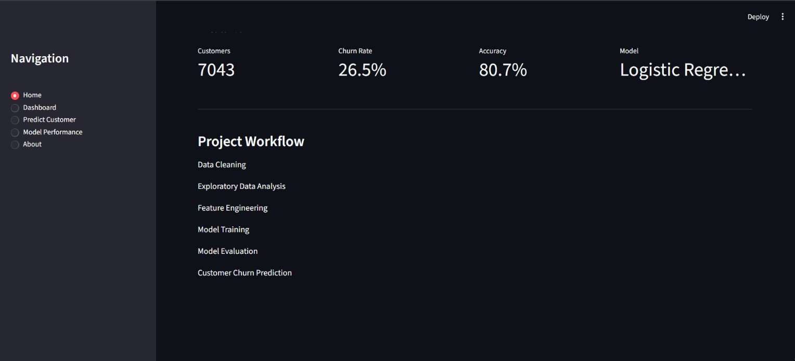
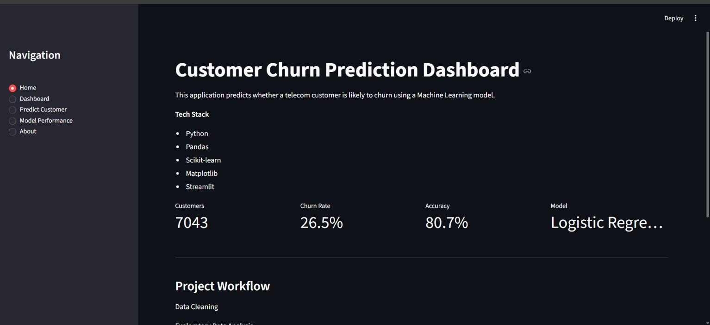
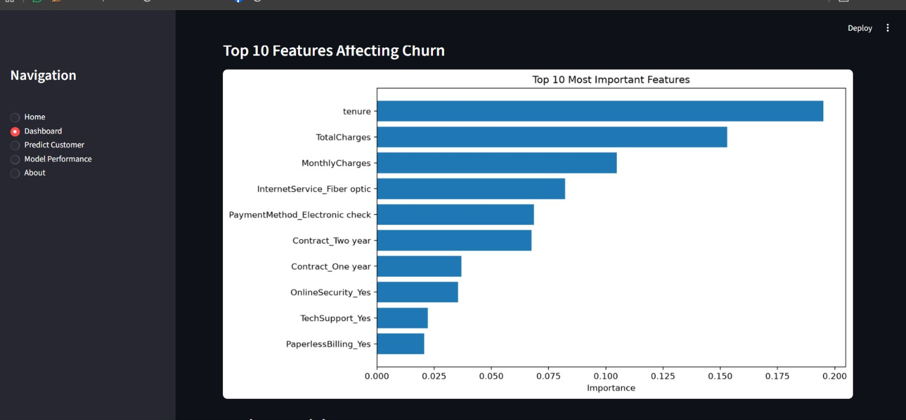
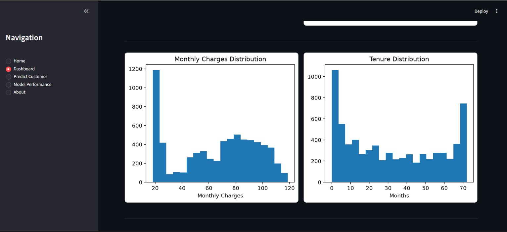
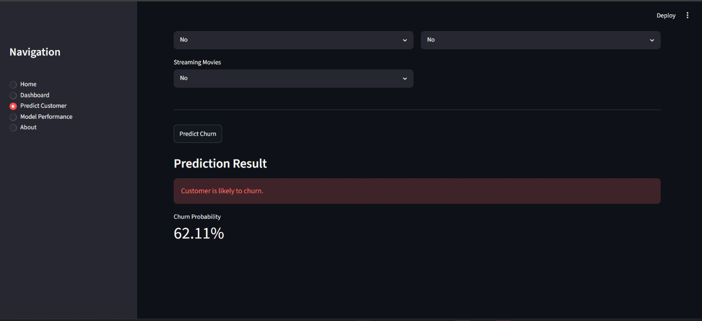
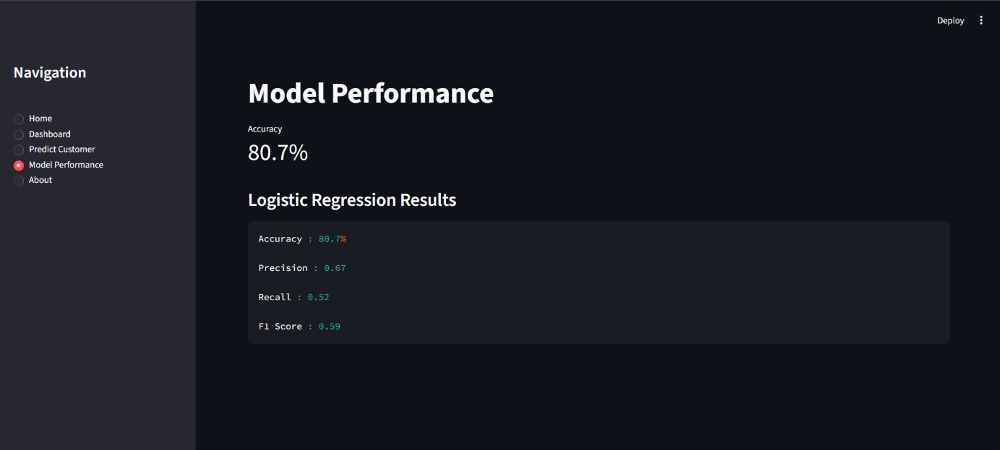
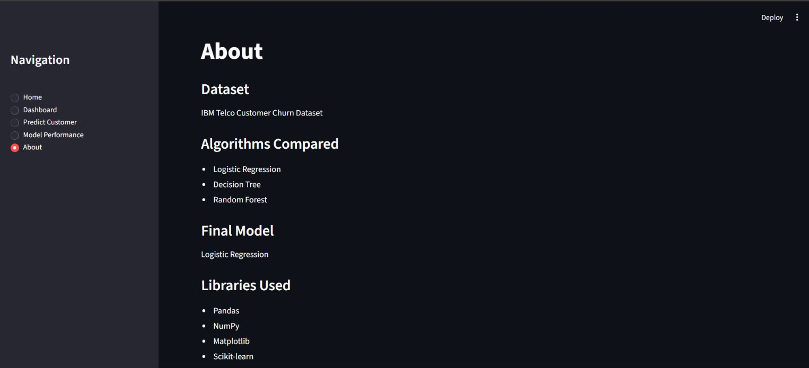
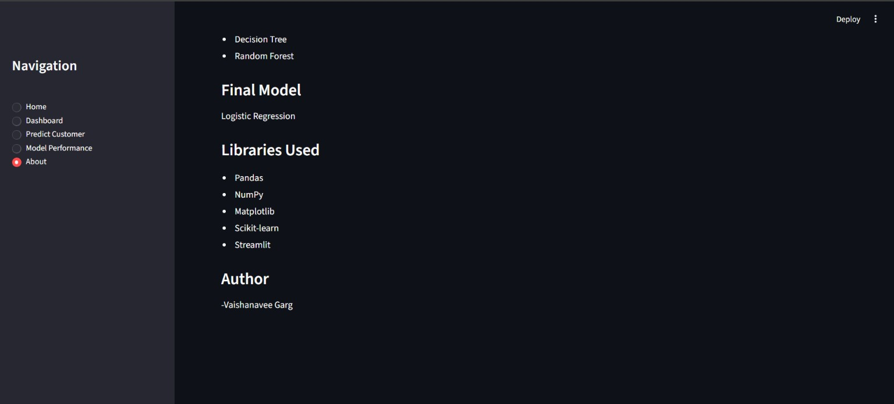

# Customer Churn Prediction Dashboard

An end-to-end Machine Learning project that predicts whether a telecom customer is likely to churn using Logistic Regression. The project includes data preprocessing, exploratory data analysis, model comparison, feature importance analysis, and deployment through an interactive Streamlit dashboard.

---

# Features

- Data Cleaning & Preprocessing
- Exploratory Data Analysis (EDA)
- Machine Learning Model Training
- Model Comparison
- Feature Importance Analysis
- Customer Churn Prediction
- Interactive Streamlit Dashboard

---

# Tech Stack

- Python
- Pandas
- NumPy
- Scikit-learn
- Matplotlib
- Streamlit
- Joblib

---

# Project Structure

```text
Customer-Churn-Prediction/
│
├── app.py
├── README.md
├── requirements.txt
│
├── data/
│   ├── data.csv
│   └── feature_importance.csv
│
├── models/
│   ├── churn_model.pkl
│   └── scaler.pkl
│
└── screenshots/
    ├── homepage01.jpg
    ├── homepage02.jpg
    ├── dashboard_business.jpg
    ├── dashboard_feature.jpg
    ├── dashboard02.jpg
    ├── customer_prediction01.jpg
    ├── customer_prediction02.jpg
    ├── model_performance.jpg
    ├── about01.jpg
    └── about02.jpg
```

---

# Application Preview

## Home Page





---

## Business Dashboard


---

## Feature Importance



---

## Customer Insights Dashboard





---


### Prediction Form


[Prediction Form](screenshots/customer_prediction.jpg)
[Prediction Form](screenshots/customer_prediction02.jpg)

### Prediction Result



---

## Model Performance




---

## About





---

# Machine Learning Models

The following classification algorithms were trained and evaluated:

| Model | Accuracy |
|-------|----------|
| Logistic Regression | **80.7%** |
| Random Forest | **79.0%** |
| Decision Tree | **74.2%** |

**Selected Model:** Logistic Regression

---

# Key Outcomes

- Cleaned and preprocessed telecom customer data.
- Performed exploratory data analysis to identify churn patterns.
- Compared multiple machine learning algorithms.
- Selected Logistic Regression based on overall performance.
- Built an interactive Streamlit dashboard for prediction and visualization.
- Saved the trained model and scaler using Joblib for deployment.

---

# Installation

Clone the repository

```bash
git clone https://github.com/YOUR_USERNAME/Customer-Churn-Prediction.git
```

Install the required packages

```bash
pip install -r requirements.txt
```

Run the application

```bash
streamlit run app.py
```

---

# Dataset

IBM Telco Customer Churn Dataset

The dataset contains:

- Customer demographics
- Account information
- Service subscriptions
- Billing information
- Churn status

---

# Future Improvements

- Implement XGBoost
- Add SHAP Explainability
- Generate Customer Retention Recommendations
- Deploy the application to the cloud
- Add User Authentication

---

# Author

**Vaishanavee Garg**

B.Tech Computer Science Student

Interests:

- Artificial Intelligence
- Machine Learning
- Data Science
- Software Development